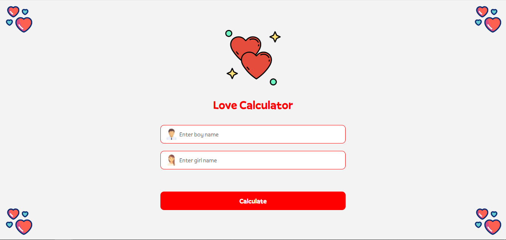
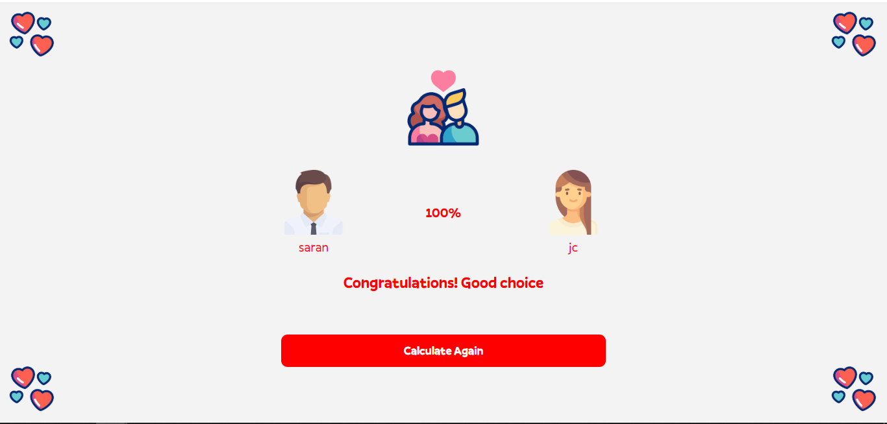

Love Calculator 💕

A fun and interactive Love Calculator app built using React and Vite, allowing users to calculate the compatibility between two names with a touch of elegance and style.

Features
✨ Compatibility Calculator: Enter two names and get a fun compatibility percentage.
✨ Dynamic Match Logic: Predefined matches for specific names with guaranteed high percentages.
✨ Smooth Navigation: Built with React Router for seamless transitions.
✨ Responsive Design: Beautiful and mobile-friendly UI for any device.
✨ Optimized for Performance: Powered by Vite for fast builds and blazing speed.

## Love Calculator Screenshots

### Home Page

### Result Page

Technologies Used
React: Frontend framework for building dynamic UI.
Vite: Modern build tool for blazing-fast development and optimized production.
React Router DOM: For routing and navigation.
CSS: Responsive and beautiful styling.
GitHub Pages: Hosting the app for easy sharing.
How It Works
Enter the names of two individuals on the home screen.
Click "Calculate" to see the compatibility percentage.
Special names like karthik, saran, or jesicka receive extra love with high match scores.
Enjoy the dynamic animations and elegant user interface.
Installation
To run this project locally, follow these steps:

Clone the Repository:

bash
Copy code
git clone https://github.com/karthiksaran018/Love-Calc.git
cd Love-Calc
Install Dependencies:

bash
Copy code
npm install
Run the Development Server:

bash
Copy code
npm run dev
Open your browser and navigate to:

arduino
Copy code
http://localhost:5173/
To build for production:

bash
Copy code
npm run build
Deployment
This app is deployed on GitHub Pages. Access it live here.

Contributing
Contributions are welcome! If you’d like to improve this project, follow these steps:

Fork the repository.
Create a new branch:
bash
Copy code
git checkout -b feature/your-feature-name
Make your changes and commit:
bash
Copy code
git commit -m "Add your feature description"
Push to the branch:
bash
Copy code
git push origin feature/your-feature-name
Open a pull request.
License
This project is licensed under the MIT License. See the LICENSE file for details.

Acknowledgments
Special thanks to Vite and React for powering this app.
Icon and GIF resources are sourced from royalty-free websites.
Future Enhancements
Add personalized messages based on compatibility percentages.
Include more animations and visual effects.
Expand to support multiple languages for a broader audience.
Enjoy using the Love Calculator and share it with your friends! ❤️
